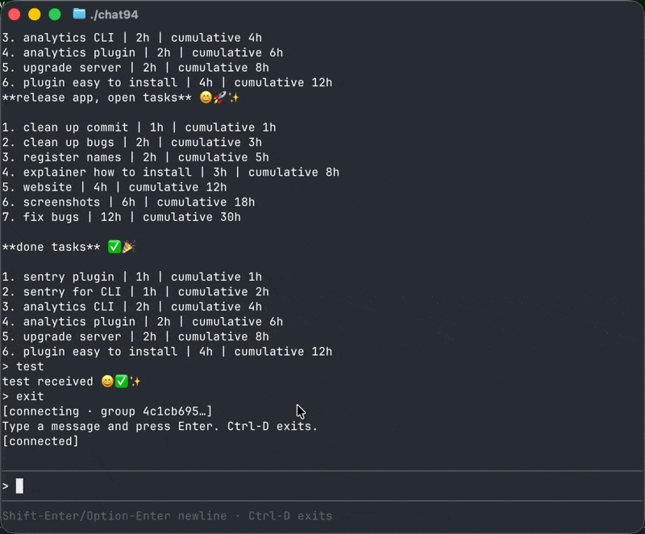

# 🦀 chat94 CLI

> Encrypted terminal client for OpenClaw agents.

<p align="center">
  
</p>

A line-based, scrollable, end-to-end-encrypted chat for your OpenClaw agent — same relay protocol, same crypto, same pairing model as the [Swift iOS/macOS client](https://github.com/chat94/chat94-apple). All intelligence lives remote; the CLI is just an encrypted pipe.

---

## 🚀 Install

**Homebrew (macOS + Linux):**
```sh
brew install chat94/tap/chat94
```

**From source:**
```sh
cargo install --git https://github.com/chat94/chat94-cli chat94
```

**Update:**
```sh
brew upgrade chat94
```

---

## ⚡ Quick start

```sh
chat94
```

First run drops you into pairing — enter a code from another device, or hit Enter to host a new group (prints a code + QR). After pairing you're in the chat.

```sh
chat94 pair             # join — enter a code
chat94 pair --host      # host — print code + QR for another device
chat94 status           # show current connection
chat94 disconnect       # forget local pairing
chat94 --help           # full flag list
```

In-session slash commands: `/help` `/status` `/pair` `/clear` `/reset-history` `/disconnect` `/support` `/quit`

---

## ⌨️ Keyboard

| Keys | Action |
|---|---|
| `Enter` | Send message |
| `Shift+Enter` / `Option+Enter` | Insert newline |
| `↑` / `↓` | Browse input history (when at bottom of transcript) |
| `Option+Backspace` | Delete previous word |
| `PgUp` / `PgDn` | Scroll transcript |
| Mouse wheel | Scroll transcript |
| `Ctrl+C` | Cancel local render / press twice to exit |
| `Ctrl+D` | Exit |

---

## 🔒 Security model

- **End-to-end encrypted.** XChaCha20-Poly1305 with a 32-byte group key. The relay sees ciphertext only.
- **Group key is the only durable secret** — stored at `~/Library/Application Support/chat94/group-config.json` (or `$XDG_CONFIG_HOME/chat94/`) with `0600` perms.
- **Pairing** is a short low-entropy code with a 5-minute TTL; the proof exchange binds the code to the exact room participants.
- **No plaintext logging.** Even at `--log-level debug`, message bodies aren't written to disk.
- **No telemetry of message content** — see below.

---

## 📊 Telemetry

chat94 sends anonymous **error reports only** to help fix bugs.

**We collect:** crash reports & stack traces, CLI version, OS platform/arch, an anonymous install ID.
**We never collect:** message content, AI prompts/responses, command-line arguments, environment variables, paths containing your username, API keys/tokens/credentials, your name/email/system username, or your IP address.

```sh
chat94 telemetry status      # see current state
chat94 telemetry disable     # opt out persistently
chat94 --no-telemetry        # opt out for one run
export CHAT94_TELEMETRY_DISABLED=1   # opt out via env
```

Privacy policy: <https://chat94.com/privacy>

---

## 📁 Local data

| Path | What |
|---|---|
| `~/Library/Application Support/chat94/group-config.json` | Group key (paired identity) |
| `~/Library/Application Support/chat94/history.jsonl` | Chat transcript, append-only JSON-lines |
| `~/Library/Application Support/chat94/input_history` | `↑` recall of past messages |
| `~/Library/Application Support/chat94/device-identity.json` | Per-device id + display name |
| `~/Library/Application Support/chat94/update-nag.json` | "Update available" 30-day throttle |
| `~/Library/Application Support/chat94/logs/` | `info.log`, `debug.log`, `exceptions.log` |
| `~/.config/chat94/` | Telemetry config (`install-id`, `telemetry-enabled`, `notice-shown`) |

(On Linux, `~/.local/share/chat94/` for data and `~/.config/chat94/` for config.)

`chat94 disconnect` wipes everything except logs and telemetry config.

---

## 🛰 Relay

Default relay endpoint:

- **WebSocket:** `wss://relay.chat94.com/ws`
- **Health:** `https://relay.chat94.com/health`

---

## 🧱 Workspace layout

```text
chat94-cli/
├── crates/
│   ├── chat94/          CLI binary
│   ├── chat94-crypto/   crypto + pairing helpers
│   ├── chat94-proto/    relay wire protocol
│   └── chat94-relay/    websocket session + pairing client
├── docs/
│   └── product.md       full product spec
├── .github/workflows/
│   └── release.yml      multi-arch binary builds on tag push
├── Cargo.toml
└── README.md
```

---

## 🛠 Build & test

```sh
cargo build
cargo test
cargo fmt --all
./target/debug/chat94 --help
```

Test coverage is strongest around protocol parsing and crypto parity with the Swift client.

---

## 🤝 Contributing

Contributions welcome. See [CONTRIBUTING.md](./CONTRIBUTING.md) — a CLA bot will prompt you on your first PR.

Talk to the team:
- 📨 Telegram: <https://t.me/chat94official>
- 🌐 Web: <https://chat94.com>
- 📚 Docs: <https://chat94.com/help>

---

## 📜 License

chat94 is licensed under the **GNU General Public License v3.0** (GPL-3.0). See [LICENSE](./LICENSE) for the full text.

Copyright © 2026 NeonNode Limited. All rights reserved.

**Commercial licensing:** if you want to use chat94 in a way that GPL-3.0 doesn't allow (e.g. proprietary/closed-source distribution), contact <contact@chat94.com>.
